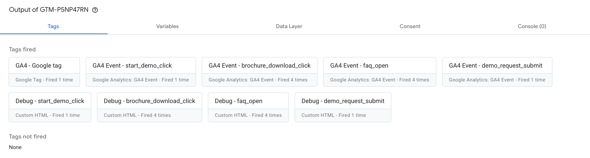
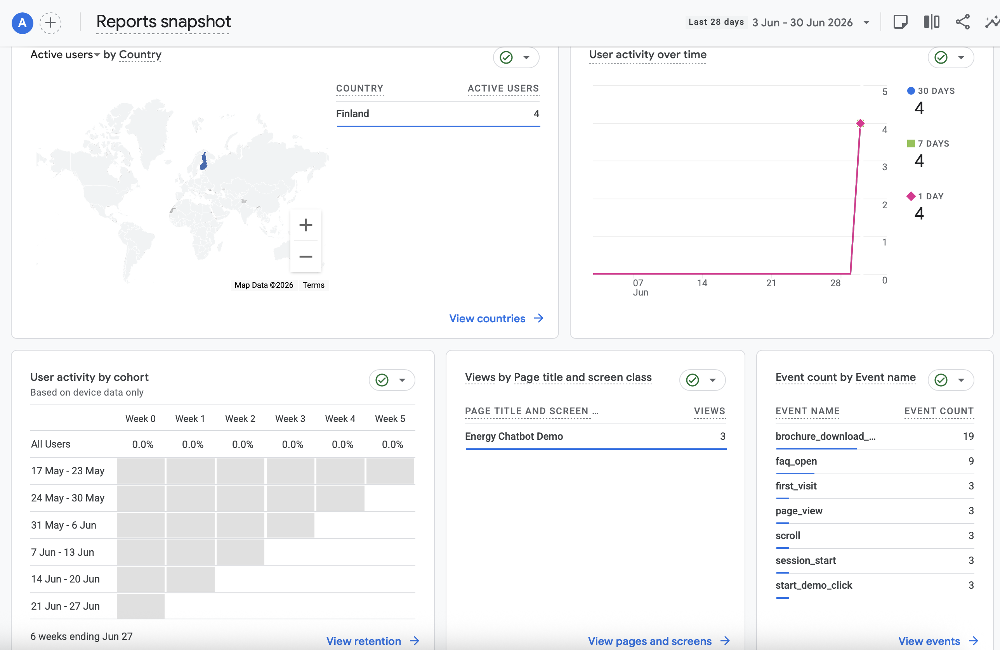

## Google Tag Manager and Google Analytics Tracking

This project includes Google Tag Manager integration for tracking user interactions on the landing page.

The website uses custom `dataLayer.push()` events in the React components. These events are handled in Google Tag Manager with Custom Event triggers and sent to Google Analytics 4 as GA4 Event tags.

### Tracking setup

The following custom events are implemented:

| Event name | Triggered when | Event parameters |
|---|---|---|
| `start_demo_click` | User clicks the "Start demo" button | `section`, `button_text` |
| `brochure_download_click` | User clicks the "Download brochure" button | `section`, `button_text` |
| `faq_open` | User opens an FAQ item | `faq_question` |
| `demo_request_submit` | User submits the demo request form | `form_name` |

### Google Tag Manager configuration

In Google Tag Manager, I configured:

- one Google tag connected to Google Analytics 4
- four GA4 Event tags
- four Custom Event triggers
- Data Layer Variables for passing event parameters

The setup was tested with Google Tag Manager Preview Mode.

### Validation

The screenshots below show that Google Tag Manager receives the custom events and fires the correct tags.

#### GTM Preview: tags fired

The screenshot shows that the main GA4 Google tag and custom GA4 Event tags were fired successfully.

#### GA4 Realtime: events received

The screenshot shows that Google Analytics 4 receives activity from the deployed website.

### Browser note

The tracking was validated in Chrome using Google Tag Manager Preview Mode and Google Analytics 4 Realtime reports. Safari may restrict analytics requests because of browser privacy protection, so GA4 activity may not always appear there during testing.